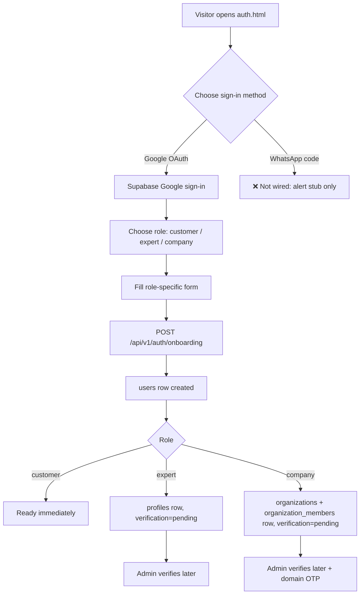

# 1. Authentication & Onboarding

Status: 🟡 Partial

## Workflow

## Completed

- `GET /api/v1/auth/provider-config` — exposes Supabase public config ([backend/app/features/auth/router.py](../../backend/app/features/auth/router.py)).
- `POST /api/v1/auth/onboarding` — creates `users` row plus role-specific `profiles`/`organizations` row in one call ([service.py](../../backend/app/features/auth/service.py)).
- `GET /api/v1/auth/me` — returns current user's profile, 404 if not onboarded.
- `GET /api/v1/auth/identities` — lists all identities (customer, personal expert profile, admin/staff companies) for one auth user.
- `POST /api/v1/auth/identities/expert` — add an expert profile to an already-onboarded account.
- `POST /api/v1/auth/identities/companies` — register a new company; caller becomes first admin.
- `POST /api/v1/auth/identities/companies/domain-otp/send` and `.../verify` — 6-digit email OTP (10 min TTL, 5 attempts, SHA-256 hashed) to prove control of company email domain; sets `organizations.email_domain_verified`.
- `POST /api/v1/auth/interests` / `DELETE /api/v1/auth/interests` — manage customer interest tags.
- Data model: [user.py](../../backend/app/models/user.py), [organization_member.py](../../backend/app/models/organization_member.py), [email_verification.py](../../backend/app/models/email_verification.py).
- Frontend: [auth.html](../../frontend/pages/auth.html) — role picker, Google button, role-specific detail forms, "pending verification" success screen.

## Not Done / To Do

- **WhatsApp OTP is a UI stub only** — the button shows an alert ("A new WhatsApp code would be sent..."); no provider (Twilio/MessageBird/etc.), no send/verify endpoints, no phone validation or rate limiting.
  - `POST /auth/send-otp { phone }`
  - `POST /auth/verify-otp { phone, code }`
- No account editing: `PATCH /auth/me` to update `full_name`, `phone`, `email` does not exist.
- No password/email recovery flow (relies entirely on Supabase, not verified end-to-end in this repo).
- No onboarding welcome email.
- Session persistence relies on Supabase's refresh token; **Time-box user sessions** must stay disabled in the Supabase dashboard so users aren't forced to re-verify with Google repeatedly (see [backend/README.md](../../backend/README.md)).
