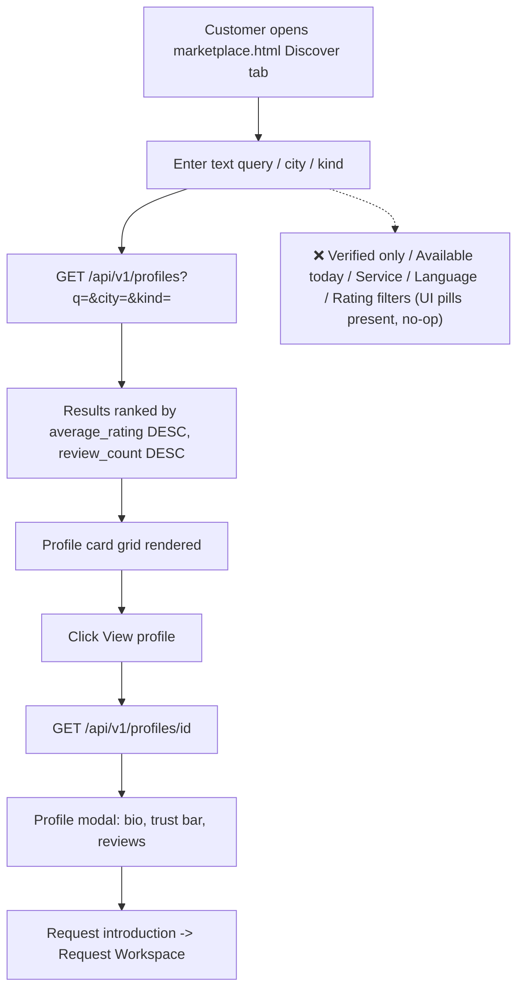

# 2. Discover / Marketplace Search

Status: 🟡 Partial

## Workflow

## Completed

- `GET /api/v1/profiles?q=&city=&kind=` — text search over name/headline, case-insensitive city match, kind filter (`expert`/`company`), sorted by rating and review count ([service.py](../../backend/app/features/marketplace/service.py)).
- `GET /api/v1/profiles/{profile_id}` — full detail incl. bio, services, and reviews with reviewer names/ratings.
- Data model: [profile.py](../../backend/app/models/profile.py) — `profiles`, `organizations`, `services`, `profile_services`, denormalized `average_rating`/`review_count`.
- Seed data: [seed.sql](../../db/seed.sql) — 3 services, 3 verified profiles with sample reviews for demoing.
- Frontend: [marketplace.html](../../frontend/pages/marketplace.html) — search panel, results grid with rating/review/response-time, profile preview modal, insights sidebar (top matches, verified review count, avg response time).

## Not Done / To Do

- Some search filters are still UI-only placeholders with no effect: **"Any location"**, **"Verified only"**, **"Available today"** pills.
- No service filter (`?service=slug1,slug2`), language filter (`?languages=`), experience range, or rating threshold — schema supports it but query params/service logic don't exist.
- No **saved profiles / comparison list** — see [10-backlog.md](10-backlog.md).
- No **recommendations** based on stored customer `interests` beyond the last search term auto-fill — see [10-backlog.md](10-backlog.md).

## Recently Completed (Sept 2026)

- `GET /api/v1/profiles` now supports `page`/`page_size` and returns them in the response ([router.py](../../backend/app/features/marketplace/router.py), [service.py](../../backend/app/features/marketplace/service.py)).
- Discover's kind select was replaced with **Experts/Companies toggle pills** (`#kind-toggle`), both checked by default, plus Prev/Next pagination controls in [marketplace.html](../../frontend/pages/marketplace.html).
