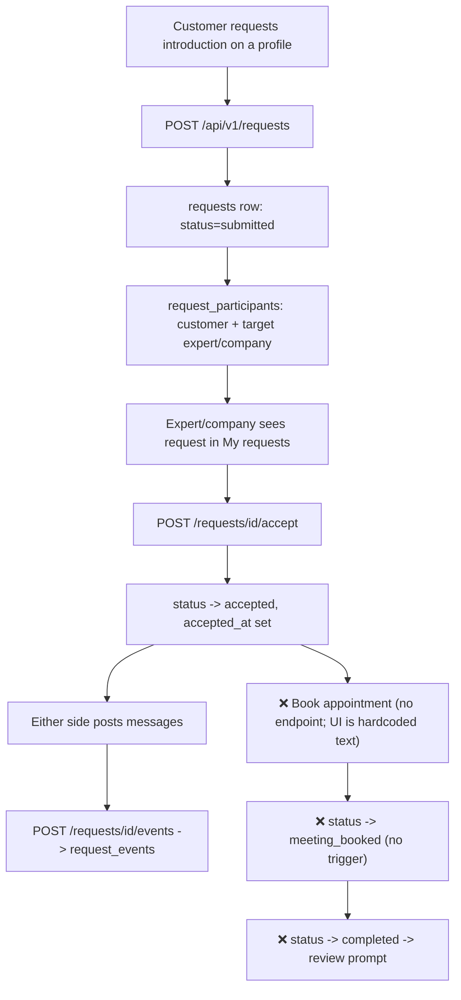

# 3. Request Workspace (Requests, Timeline, Appointments)

Status: 🟡 Partial

## Workflow

## Completed

- `POST /api/v1/requests` — customer creates request against a target profile; auto-creates the counterpart `request_participants` row.
- `GET /api/v1/requests` — lists all requests the caller participates in (as customer, expert, or company admin), with counterpart name and `my_role`.
- `GET /api/v1/requests/{request_id}` — full detail (participants + event timeline), access-controlled to participants only.
- `POST /api/v1/requests/{request_id}/events` — post a timeline message.
- `POST /api/v1/requests/{request_id}/accept` — expert/company participant accepts; `submitted` → `accepted`.
- Data model: [request.py](../../backend/app/models/request.py) — `requests`, `request_participants` (exactly one of `user_id`/`organization_id` set), `request_events`.
- Status enum already models the full lifecycle: `submitted → accepted → meeting_booked → provider_invited → completed → cancelled`.
- Frontend: [marketplace.html](../../frontend/pages/marketplace.html) "My requests" view — sidebar list, timeline, accept button, message form (note: sidebar list is currently hardcoded sample data, not wired to `GET /requests`).

## Not Done / To Do

- **Appointments are schema-only** — `appointments` table exists in [schema.sql](../../db/schema.sql) (`request_id`, `starts_at`, `ends_at`, `meeting_url`, `status`) but has **no API endpoints and no model file** under `backend/app/models/`. Needed:
  - `POST /requests/{request_id}/appointments` — propose a slot
  - `PATCH /appointments/{appointment_id}` — confirm/reschedule/cancel
  - `GET /requests/{request_id}/appointments`
  - Trigger: confirming an appointment should move `requests.status` to `meeting_booked`.
- No endpoint transitions status to `provider_invited` or `completed` — these are dead enum values today.
- No cancellation endpoint (`POST /requests/{id}/cancel`).
- Frontend "My requests" sidebar list is hardcoded (3 sample requests) instead of calling `GET /api/v1/requests`.
- No notifications when a request is created/accepted/messaged (see [09-notifications-billing.md](09-notifications-billing.md)).
