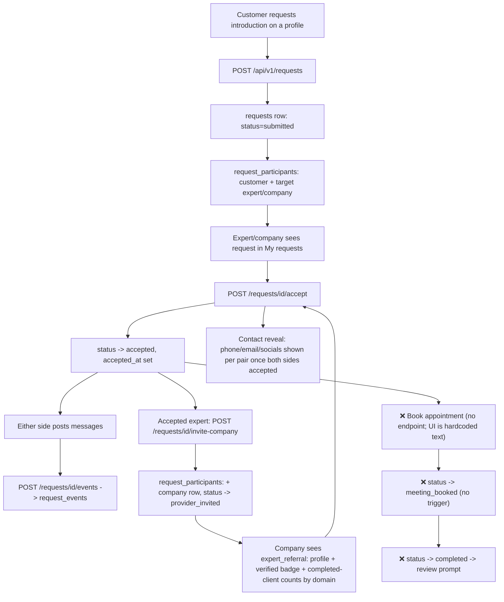

# 3. Request Workspace (Requests, Timeline, Appointments)

Status: 🟡 Partial

## Workflow

```mermaid
flowchart TD
    A[Customer requests introduction on a profile] --> B[POST /api/v1/requests]
    B --> C[requests row: status=submitted]
    C --> D[request_participants: customer + target expert/company]
    D --> E[Expert/company sees request in My requests]
    E --> F[POST /requests/id/accept]
    F --> G[status -> accepted, accepted_at set]
    G --> H[Either side posts messages]
    H --> I[POST /requests/id/events -> request_events]
    G --> M[Accepted expert: POST /requests/id/invite-company]
    M --> N[request_participants: + company row, status -> provider_invited]
    N --> O[Company sees expert_referral: profile + verified badge + completed-client counts by domain]
    O --> F
    F --> P[Contact reveal: phone/email/socials shown per pair once both sides accepted]
    G --> J["❌ Book appointment (no endpoint; UI is hardcoded text)"]
    J --> K["❌ status -> meeting_booked (no trigger)"]
    K --> L["❌ status -> completed -> review prompt"]
```

## Completed

- `POST /api/v1/requests` — customer creates request against a target profile; auto-creates the counterpart `request_participants` row. Accepts an optional `service_id` so the request's domain can be tracked.
- `GET /api/v1/requests` — lists all requests the caller participates in (as customer, expert, or company admin), with counterpart name and `my_role`.
- `GET /api/v1/requests/{request_id}` — full detail (participants + event timeline), access-controlled to participants only.
- `POST /api/v1/requests/{request_id}/events` — post a timeline message.
- `POST /api/v1/requests/{request_id}/accept` — expert/company participant accepts; `submitted` → `accepted`.
- `POST /api/v1/requests/{request_id}/invite-company` (Sept 2026) — an expert who has already accepted the request can add a company profile as a 3rd `request_participants` row on the **same** request/timeline (not a new request). Rejects a profile that isn't `kind=company`, and rejects re-inviting a company already on the request (409). Moves `requests.status` to `provider_invited`.
- Expert credibility snapshot (Sept 2026): `RequestDetail.expert_referral` — populated whenever the request has an expert participant, visible to every participant (in particular the company being invited). Includes `profile_id`, `display_name`, `headline`, `verified`, `average_rating`, `review_count`, and `client_stats` (distinct **completed**-request customers grouped by `requests.service_id` → service name, `"General"` if unset). Computed in [service.py `_expert_referral_info`](../../backend/app/features/requests/service.py).
- Contact reveal (Sept 2026): each `RequestParticipantOut.contact` (full name, email, phone, `website_url` for companies, `social_links`) is populated only when **both** the viewer and that participant have accepted their role in the request — the customer is always treated as "accepted" since they opened it. A company's contact card uses its earliest `admin` `organization_members` row for phone/email. Social links are read from the new `SocialLink` model (`backend/app/models/social_link.py`) against the `social_links` table — there is still no endpoint to *create* social links (see [07-expert-profiles.md](07-expert-profiles.md)), so this stays empty until rows are added directly.
- Data model: [request.py](../../backend/app/models/request.py) — `requests`, `request_participants` (exactly one of `user_id`/`organization_id` set; a request can now have multiple non-customer participants, e.g. expert + company), `request_events`.
- Status enum already models the full lifecycle: `submitted → accepted → meeting_booked → provider_invited → completed → cancelled`. `provider_invited` is now actually reachable via `invite-company`.
- Frontend: [marketplace.html](../../frontend/pages/marketplace.html) "My requests" view — sidebar list (wired to `GET /requests`), timeline, accept button, "+ Invite a company" button (shown to an accepted expert with no company yet on the request; opens a company search modal), participant list with revealed contact details, and an "Expert track record" panel showing `expert_referral` client stats.

## Not Done / To Do

- **Appointments are schema-only** — `appointments` table exists in [schema.sql](../../db/schema.sql) (`request_id`, `starts_at`, `ends_at`, `meeting_url`, `status`) but has **no API endpoints and no model file** under `backend/app/models/`. Needed:
  - `POST /requests/{request_id}/appointments` — propose a slot
  - `PATCH /appointments/{appointment_id}` — confirm/reschedule/cancel
  - `GET /requests/{request_id}/appointments`
  - Trigger: confirming an appointment should move `requests.status` to `meeting_booked`.
- No endpoint transitions status to `completed` — still a dead enum value, which means `expert_referral.client_stats` and the resolved-clients badge both stay at 0 in production until a "mark completed" endpoint exists. This is the single highest-priority gap before the new referral stat is meaningful.
- No cancellation endpoint (`POST /requests/{id}/cancel`).
- No decline endpoint for a company to reject an `invite-company` (they can just never accept, but the invite then sits forever with no way to remove it).
- No notifications when a request is created/accepted/messaged/invited (see [09-notifications-billing.md](09-notifications-billing.md)).
- `CreateRequestPayload.service_id` is optional and not yet surfaced in the frontend "Request a consultation" form — customers can't pick a domain yet, so new requests will keep landing in the `"General"` bucket of `client_stats`.
