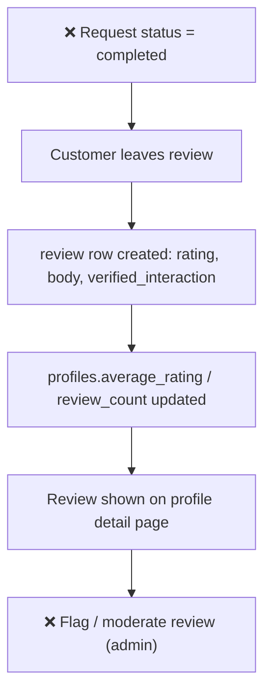

# 4. Reviews & Trust Model

Status: 🟡 Partial

## Workflow

## Completed

- Data model: [review.py](../../backend/app/models/review.py) — `reviews` table (`request_id`, `reviewer_id`, `profile_id`, `rating` 1–5, `body`, `verified_interaction`, `created_at`), unique per `(request_id, reviewer_id, profile_id)`.
- Denormalized `profiles.average_rating` / `profiles.review_count` kept in sync when a review is created.
- Reviews are shown on the profile detail response (`GET /api/v1/profiles/{id}`) and rendered in [marketplace.html](../../frontend/pages/marketplace.html) profile modal.
- Seed data includes sample verified reviews ([seed.sql](../../db/seed.sql)).

## Not Done / To Do

- **No endpoint to create a review.** The table and relationships exist, but there is no `POST /requests/{request_id}/reviews` (or similar) in [requests router](../../backend/app/features/requests/router.py) or elsewhere.
- No trigger tying review creation to a `completed` request (that status transition itself doesn't exist yet — see [03-request-workspace.md](03-request-workspace.md)).
- No **review moderation**: no `flagged`/`moderation_status` columns, no admin listing/hide/delete endpoints.
- No customer-facing "completed requests awaiting review" prompt (would live in customer dashboard, see [08-dashboards.md](08-dashboards.md)).
- No dispute path for contested reviews (see [10-backlog.md](10-backlog.md)).
