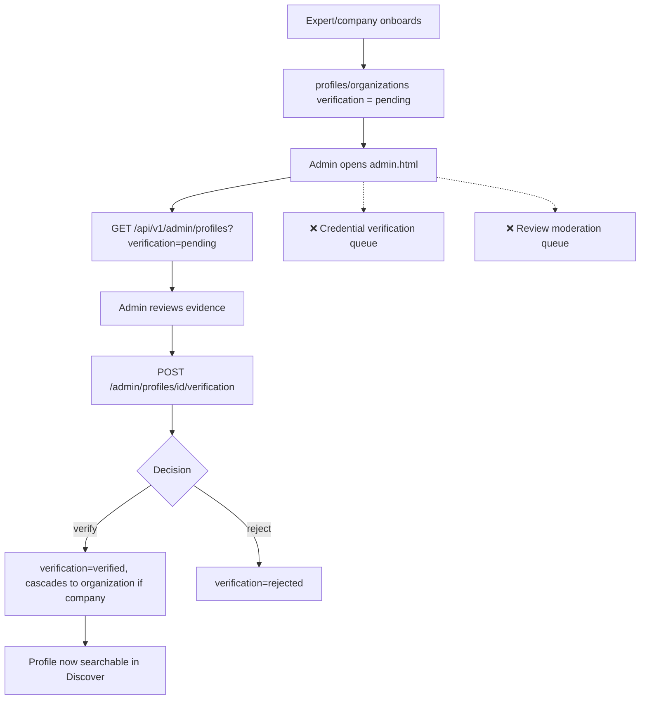

# 5. Admin Verification Console

Status: 🟡 Partial

## Workflow

## Completed

- `GET /api/v1/admin/profiles?verification=pending|verified|rejected` — list profiles by status, `platform_admin`-only ([router.py](../../backend/app/features/admin/router.py)).
- `POST /api/v1/admin/profiles/{profile_id}/verification` — approve/reject; cascades to the linked `organization` when the profile is a company.
- Access control via `require_platform_admin()` in [security/dependencies.py](../../backend/app/security/dependencies.py), gated on `users.role == platform_admin`.
- Frontend: [admin.html](../../frontend/pages/admin.html) — Pending/Verified/Rejected tabs, profile cards, verify/reject buttons.

## Not Done / To Do

- Admin console only covers **profile verification** — there is no queue for:
  - `credentials` (table exists in [schema.sql](../../db/schema.sql), no endpoints at all — see [07-expert-profiles.md](07-expert-profiles.md))
  - review moderation (see [04-reviews-trust.md](04-reviews-trust.md))
  - disputes (see [10-backlog.md](10-backlog.md))
- `admin.html` has **no built-in login/role check** in the page itself; it relies on the signed-in Supabase session already having `platform_admin` role — worth hardening (redirect/guard on load, not just server-side 403s).
- No audit trail of who verified/rejected a profile and why (no `verified_by`, `verified_at`, `rejection_reason` columns).
