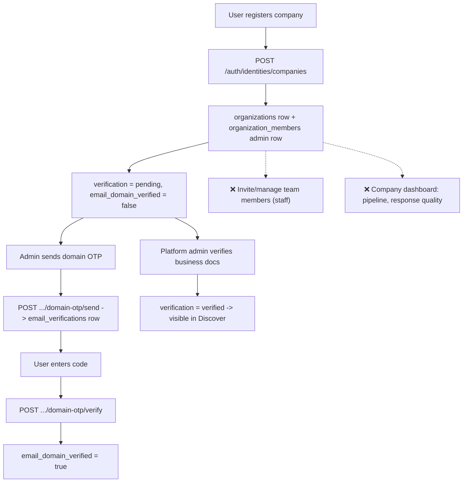

# 6. Company Features

Status: 🟡 Partial

## Workflow

## Completed

- `POST /api/v1/auth/identities/companies` — registers a new company; caller becomes first `admin` member.
- `POST /api/v1/auth/identities/companies/domain-otp/send` and `/verify` — 6-digit email OTP flow (10 min TTL, 5 attempts, SHA-256 hash) proving control of the company's email domain.
- `GET /api/v1/auth/identities` — lists all companies a user administers/staffs.
- Data model: [organization_member.py](../../backend/app/models/organization_member.py) (`member_role`: admin/staff, unique per org+user), `organizations` in [profile.py](../../backend/app/models/profile.py) (slug auto-generated, `email_domain_verified`, `subscription_tier`).
- Frontend: [marketplace.html](../../frontend/pages/marketplace.html) workspace switcher — lists companies the user administers, "Register company" modal.

## Not Done / To Do

- **No team management endpoints** — `organization_members` table supports `staff` role but there is no way to invite, list, change role, or remove members:
  - `GET /organizations/{org_id}/members`
  - `POST /organizations/{org_id}/members` (invite by email)
  - `PATCH /organizations/{org_id}/members/{member_id}` (role change)
  - `DELETE /organizations/{org_id}/members/{member_id}`
- **No company dashboard** — request pipeline by stage, team size, response-quality metrics (see [08-dashboards.md](08-dashboards.md)).
- No company profile editing (name, description, website, city) after creation.
