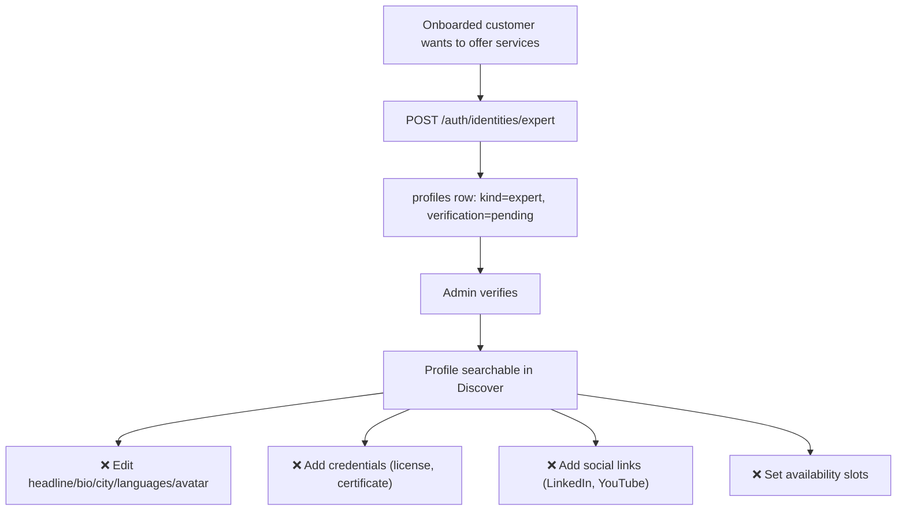

# 7. Expert Profiles

Status: 🟡 Partial

## Workflow

## Completed

- `POST /api/v1/auth/identities/expert` — adds a personal expert profile to an already-onboarded account (one expert profile per user, enforced by unique constraint).
- Data model: [profile.py](../../backend/app/models/profile.py) — `profiles` with `headline`, `bio`, `city`, `years_experience`, `languages` (array), `avatar_url`, `verification`.
- Verification gate: new expert profiles start `pending` and only appear in search once admin-approved (see [05-admin-verification.md](05-admin-verification.md)).
- Frontend: [auth.html](../../frontend/pages/auth.html) expert onboarding form (headline, primary service, years experience, credential number field); [marketplace.html](../../frontend/pages/marketplace.html) "Become an expert" modal.

## Not Done / To Do

- **No profile editing** — no `PATCH /profiles/{profile_id}` for headline/bio/city/languages/years_experience/avatar after creation.
- **No avatar upload** — `avatar_url` is a column but there is no upload endpoint or storage wiring.
- **No credentials endpoints** — `credentials` table exists in [schema.sql](../../db/schema.sql) (`title`, `issuing_body`, `credential_number`, `document_url`, `verification`) but has no model file and zero API surface:
  - `POST /profiles/{profile_id}/credentials`
  - `GET /profiles/{profile_id}/credentials`
  - `PATCH` / `DELETE /credentials/{credential_id}`
  - `POST /credentials/{credential_id}/verify` (admin)
- **No social links endpoints** — `social_links` table exists (`platform`, `url`, `follower_count`) with no model or API:
  - `POST /profiles/{profile_id}/social-links`
  - `GET /profiles/{profile_id}/social-links`
  - `DELETE /profiles/{profile_id}/social-links/{id}`
- **No availability model** — expert availability windows referenced in [PRODUCT.md](../../PRODUCT.md) have no table, model, or endpoints.
- No profile-completion checklist/percentage.
