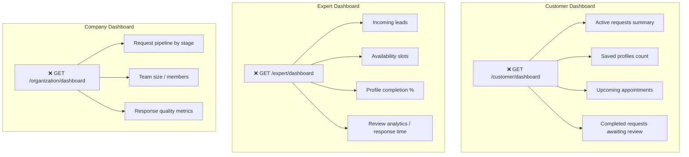

# 8. Customer / Expert / Company Dashboards

Status: ❌ Not started (no dedicated endpoints or pages; only building blocks exist)

## Workflow (Intended)

## Completed (Building Blocks Only)

- `GET /api/v1/requests` already returns every request the caller participates in with `my_role`, which a dashboard could reuse for "active requests" / "incoming leads".
- `GET /api/v1/auth/me` and `GET /api/v1/auth/identities` provide the user/company context a dashboard would need.
- `organization_members` model supports listing team size once a members endpoint exists ([06-company-features.md](06-company-features.md)).

## Recently Completed (Sept 2026)

- Fixed a bug where switching "Acting as" to Expert/Company forced navigation away from the dashboard to My Requests. It now stays on Discover and refreshes results in place.
- Discover now shows a **"Customers" pill** (default-selected when acting as Expert/Company) that renders incoming customer requests inline, reusing `GET /api/v1/requests` — a lightweight stand-in for a real expert/company dashboard.
- Added client-side premium gating: viewing other Experts' (as an Expert) or other Companies' (as a Company) profiles is blurred behind an "Upgrade to view" overlay pointing at the new Plans tab. This is presentation-only — no backend access control yet.
- Added a **Plans** tab (static Free/Pro/Enterprise pricing cards) and a **Payment** nav item, both routing to WhatsApp (`wa.me/916382595243`) since there's no billing backend.

## Not Done / To Do

- No dedicated dashboard pages/endpoints exist beyond the Discover-embedded leads list above (only `marketplace.html`, `auth.html`, `admin.html`).
- No dashboard aggregation endpoints for any role:
  - `GET /customer/dashboard` — active requests, saved profiles, upcoming appointments, completed-awaiting-review, interest-based recommendations.
  - `GET /expert/dashboard` — incoming leads, availability, profile completeness, review analytics, response-time metrics.
  - `GET /organization/dashboard` — requests-by-stage counts, team size, response-quality metrics, recent activity.
- Depends on other unfinished pieces: appointments API ([03-request-workspace.md](03-request-workspace.md)), saved profiles ([10-backlog.md](10-backlog.md)), team management ([06-company-features.md](06-company-features.md)), review-to-request completion flow ([04-reviews-trust.md](04-reviews-trust.md)).
