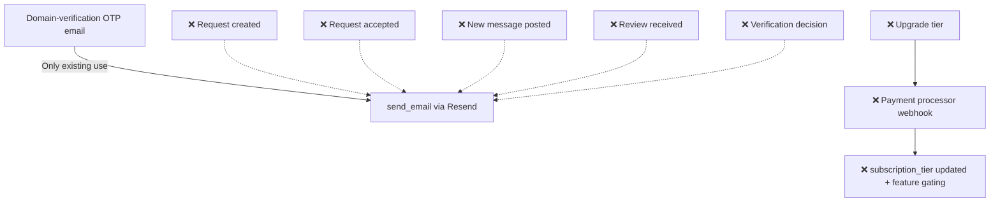

# 9. Notifications & Subscription Billing

Status: ❌ Not started (email infra exists but is only used for OTP)

## Workflow (Intended)

## Completed

- [send_email() in email.py](../../backend/app/features/auth/email.py) — Resend API integration, currently used only for company domain-verification OTP codes.
- `users.subscription_tier` and `organizations.subscription_tier` columns exist (`free|pro|enterprise`, default `free`) — see [profile.py](../../backend/app/models/profile.py) / [user.py](../../backend/app/models/user.py).

## Not Done / To Do

**Notifications**
- No transactional emails for: request created, request accepted, new timeline message, review received, verification approved/rejected, onboarding welcome.
- No async delivery mechanism (BackgroundTasks/queue) — everything today is synchronous inline.
- No notification preference table (per user, per event type, opt in/out).

**Billing**
- No pricing/plan definitions endpoint.
- No payment processor integration (Stripe/Razorpay/etc.).
- No upgrade/downgrade endpoints or webhook handling.
- No feature gating tied to `subscription_tier` (columns exist but nothing reads them to change behavior).
- No billing history/invoices.
